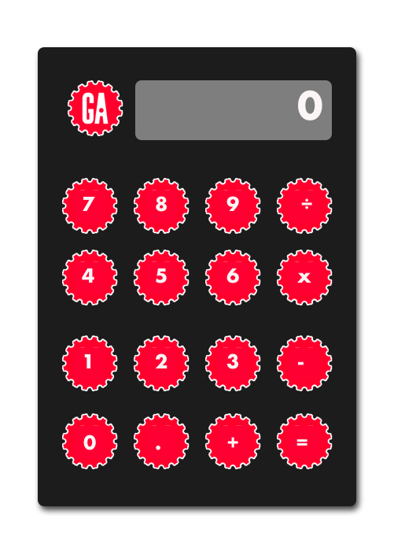

# JavaScript DOM Calculator Lab

tktk Hunter - we need an asset that says "JavaScript DOM Calculator Lab"

## Introduction

This lab provides us with an opportunity to practice DOM manipulation by building a calculator in the browser.

## Lab content

- [Setup](./setup/README.md)
- [Lab exercise](./exercise/README.md)
- [tktk Solution code](#tktk-external-repo-link)

## Time to complete

Estimated time to complete core lab exercise: **180 minutes**

### 🚀 Level Up

- [Creating User Stories](./level-up/creating-user-stories.md)
- [History of HTML](./level-up/history-of-html.md)
- [Emmet](./level-up/emmet.md)

## Internal resources

✏️ [Instructor Guide](./internal-resources/instructor-guide.md)

🏗️ [Release Notes](./internal-resources/release-notes.md)

---

**Find a 👾 bug 👾 or have suggestions? [Let us know](https://git.generalassemb.ly/modular-curriculum-all-courses/universal-resources-internal/blob/main/module-feedback.md)!**
